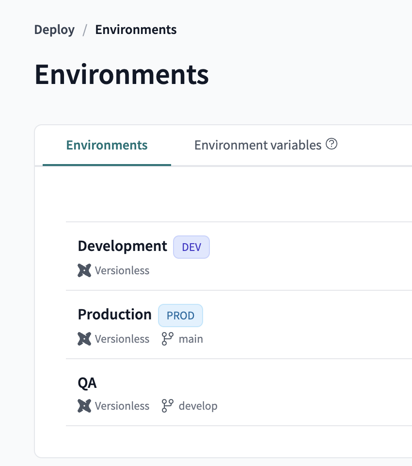
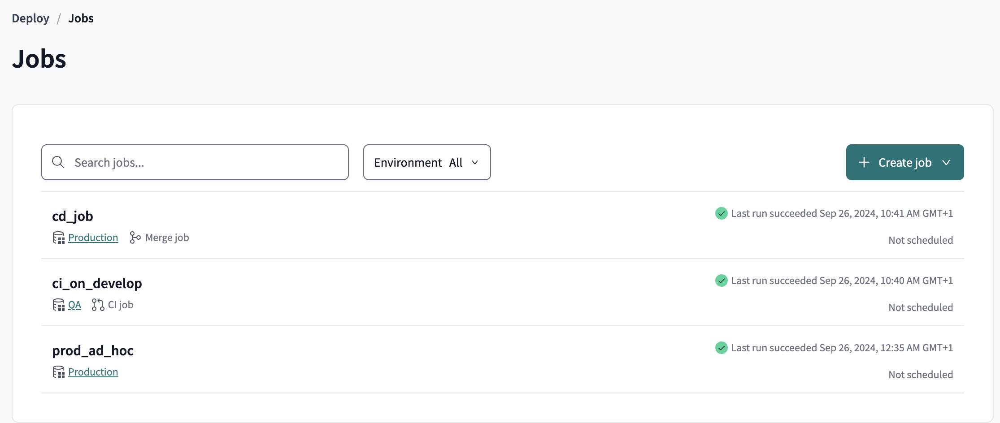
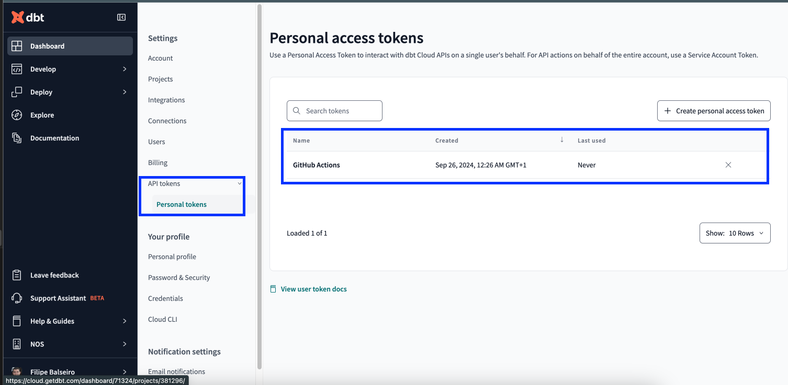

## 1. Project Overview

The goal of this project is to showcase how to leverage GitHub Actions workflows to solve a current caveat on using the `state: selection method` for `seed` files that are > 1 MB in size. 

If a seed file is > 1 MB in size, dbt cannot compare its contents and will raise a warning as such. Instead, dbt will use only the seed's file path to detect changes. If the file path has changed, the seed will be included in `state:modified`. Otherwise, it won't.

To avoid this, the common approach when using dbt Cloud as the deployment platform is to add a step to your job to perform a `dbt seed --full-refresh` command to garantee that your seeds are always refreshed, even if there are no changes in the seed file.

A proposed more efficient solution is to use a GitHub Actions workflow that is triggered on every push to the `main` branch (that corresponds to production environment on dbt Cloud) to compare the previous and current commit of the `main` branch to get the list of modified seed files. If there any modified seed files, the workflow will trigger a dbt cloud job to perform a `dbt seed --full-refresh` command on the modified seeds only.

By doing so, we guarantee that the seeds only refresh when needed, being able to save costs on computation resources.

**Note**: If like me you are using dbt Cloud free tier, you won't be able to use the dbt Cloud API to trigger a dbt Cloud job from a GitHub Actions workflow.

### 1.1 Requirements

- [ ] Visual Studio Code
- [ ] Python 3.11
- [ ] Git

### 1.2 Git

- Confirm `git` is installed: ```git --version```

---

## 2. Clone the Project Repository

Before cloning your repo, you should open your terminal to a development folder to store our project code in.

For example:

``` shell
# Ensure that you are in your "home" directory
cd ~

# Create a new development directory, if it doesn't already exist
mkdir Develop

# Change to the development directory
cd Develop

# Clone project repository
git clone https://github.com/FilipeTheAnalyst/dbt_cloud_seed.git
```
---
## 3. Create a free trial account on Snowflake and dbt Cloud

### 3.1. Create a free trial account on Snowflake
- Go to [Snowflake](https://signup.snowflake.com/) and create a free trial account choosing AWS as the cloud provider.
- Execute the following [setup steps](_project_docs/snowflake_setup.md).

### 3.2. Create a dbt Cloud account (free tier available for 1 project)
- Go to [dbt Cloud](https://www.cloud.getdbt.com/) and create a free trial account.
- Connect your dbt Cloud account to [GitHub](https://docs.getdbt.com/docs/cloud/git/connect-github)
- Connect your dbt Cloud account to [Snowflake](https://docs.getdbt.com/docs/cloud/connect-data-platform/connect-snowflake)
- Create a new project and connect it to your GitHub repository
- Create the environments on dbt Cloud shown on the image below. Can also check the [dbt documentation](https://docs.getdbt.com/docs/dbt-cloud-environments) with additional details.

- Create the following jobs on dbt Cloud:


**Note:** The `prod_ad_hoc` is the job that will be triggered by the GitHub Actions workflow.

---

## 4. Setup Your Python Environment (MacOS)

Install the following components to setup your Python environment:

- ```python 3.11```
- ```virtualenv```: python package to create a Python virtual environment to isolate the required packages for the project to prevent dependency issues

``` shell
brew install python@3.11 virtualenv just
```

Create your Python virtual environment.

``` shell
# Change to dbt_cloud_seed repository root folder
cd dbt_cloud_seed/

# Setup a project python virtual environment
virtualenv .venv --python=python3.11

```

## 5. Activate Your Virtual Environment

***Every time*** you open a new terminal, you will need to source your Project Python environment:

``` bash
# Source your project environment
source .venv/bin/activate
```

## 6. Install Python packages required
Run the following command to install the required Python packages for the project:

``` bash
pip install -r requirements.txt
```

## 7. Setup dbt Project

- Rename the [`env.sample`](env.sample) file to `.env` on the repository main directory
- Add the respective credentials for each variable
- To setup the account name you can check [dbt documentation](https://docs.getdbt.com/docs/core/connect-data-platform/snowflake-setup#account) on how to get the account name
- Update the `schema` property on `profiles.yml` [file](profiles.yml) to your own following the naming convention (ex: `SANDBOX_FBALSEIRO`)
- Execute the command on your terminal
 ``` bash
source .env
```
- To check if it worked as supposed you can run the command `echo $DBT_USER` and you should get the respective value
- Execute the command `dbt debug` to check if dbt can commmunicate properly with the data platform (Snowflake)

**Reminder**: every time you open a new working session, you have to run these two commands:

 ``` bash
source .venv/bin/activate # Activate python virtual environment
source .env # Activate environment variables
```

### 7.1. Manage dbt environments

dbt makes it easy to maintain separate production and development environments through the use of `targets` within a `profile`.

Below is a snippet of the `profiles.yml` file with the credentials definition for the following target environmens applied to `dbt_template` dbt project:

- **dev**: environment used for development;
- **qa**: environment used for CI (Continuous Integration) deployment to test changes before promoting the code for the next environment;
- **prod**: environment used for production

```yaml
---
atp_tour:

  target: dev

  outputs:

    dev:

      type: snowflake

      account: "{{ env_var('SNOWFLAKE_ACCOUNT') }}"

      user: "{{ env_var('DBT_USER') }}"

      password: "{{ env_var('DBT_PASSWORD') }}"

      role: "{{ env_var('SNOWFLAKE_ROLE') }}"

      database: "{{ env_var('SNOWFLAKE_DATABASE') }}"

      warehouse: "{{ env_var('SNOWFLAKE_WAREHOUSE') }}"

      schema: DBT_FBALSEIRO

      threads: 16

    prod:

      type: snowflake

      account: "{{ env_var('SNOWFLAKE_ACCOUNT') }}"

      user: "{{ env_var('DBT_USER') }}"

      password: "{{ env_var('DBT_PASSWORD') }}"

      role: "{{ env_var('SNOWFLAKE_ROLE') }}"

      database: "{{ env_var('SNOWFLAKE_DATABASE') }}"

      warehouse: "{{ env_var('SNOWFLAKE_WAREHOUSE') }}"

      schema: ANALYTICS

      threads: 16

    qa:

      type: snowflake

      account: "{{ env_var('SNOWFLAKE_ACCOUNT') }}"

      user: "{{ env_var('DBT_USER') }}"

      password: "{{ env_var('DBT_PASSWORD') }}"

      role: "{{ env_var('SNOWFLAKE_ROLE') }}"

      database: "{{ env_var('SNOWFLAKE_DATABASE') }}"

      warehouse: "{{ env_var('SNOWFLAKE_WAREHOUSE') }}"

      schema: ANALYTICS_QA

      threads: 16
```

Breaking down the above `profiles.yml` file structure to better understand the properties definition:

```yaml
---
<profile-name>:
  target: <target-name> # this is the default target
  outputs:
    <target-name>:
      type: <bigquery | postgres | redshift | snowflake | other>
      schema: <schema_identifier>
      threads: <natural_number>

      ### database-specific connection details
      ...

    <target-name>: # additional targets
      ...

<profile-name>: # additional profiles
  ...
```

All the properties with a value like `"{{ env_var('DBT_USER') }}"` are referencing an environment variable with that name (ex: `DBT_USER`) that should be stored inside a `.env` file on your local workstation.

## 8. GitHub Actions (Workfllows)

GitHub Actions is a feature that enables to build, test and deploy your code right from GitHub, following CI/CD best practices.

To define a workflow you need to create a `.yml` file under `.github/workflows/` folder.

[Here](https://docs.github.com/en/actions) is the documentation for more details.

### 8.1 Github Secrets
In order to manage the environment variables used for the dbt project, GitHub uses ***secrets*** to store that sensitive information.
[Here](https://docs.github.com/en/actions/security-guides/using-secrets-in-github-actions#creating-secrets-for-a-repository) is the documentation with the steps to follow to achieve that.

In this use case we have the following secrets:
- **DBT_ACCOUNT_ID:** It represents the account ID of the dbt Cloud account.
- **DBT_JOB_ID:** It represents the job ID of the `prod_ad_hoc` dbt Cloud job.
- **DBT_API_TOKEN:** It represents the API token of the dbt Cloud account.

If you go to the dbt job `prod_ad_hoc` main page on dbt cloud, your url will look like this: `https://cloud.getdbt.com/deploy/{account_id}/projects/{project_id}/jobs/{job_id}` and you can get the `account_id`, `project_id` and `job_id` from there.

To get the `API_TOKEN` you can go to the dbt Cloud profile settings and click on the `Personal tokens` tab under `API Tokens` section, like the image below:

